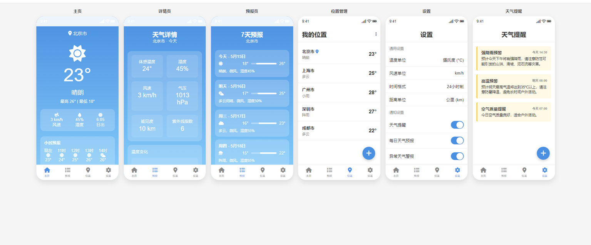
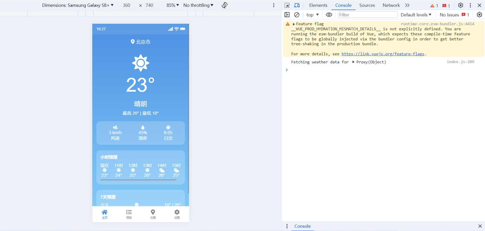

# 天气应用 (Weather App)

一个基于Vue 3开发的现代化天气应用，提供实时天气、天气预报、天气详情和位置管理等功能。

## 功能特点

- **实时天气信息**：显示当前温度、天气状况、最高/最低温度等
- **每小时预报**：查看未来几小时的天气变化
- **7天天气预报**：查看未来一周的天气情况
- **天气详情**：提供湿度、风速、气压、能见度等详细信息
- **多位置管理**：添加、删除和切换多个位置
- **天气警报**：接收重要天气警报通知
- **个性化设置**：自定义温度单位、风速单位、时间格式等

## 技术栈

- **前端框架**：Vue 3
- **状态管理**：Vuex 4
- **路由管理**：Vue Router 4
- **UI组件库**：Vant UI
- **图表库**：ECharts
- **HTTP请求**：Axios

## 原型图

原型图如下：



## 项目结构

```
weather-app/
├── public/                 # 静态资源
├── src/                    # 源代码
│   ├── api/                # API接口
│   ├── assets/             # 图片等资源
│   ├── components/         # 公共组件
│   ├── router/             # 路由配置
│   ├── store/              # Vuex状态管理
│   ├── utils/              # 工具函数
│   ├── views/              # 页面视图组件
│   ├── App.vue             # 根组件
│   └── main.js             # 入口文件
├── .eslintrc.js            # ESLint配置
├── babel.config.js         # Babel配置
├── package.json            # 项目依赖
└── vue.config.js           # Vue CLI配置
weather-prototype.html      # 原型图
```

## 安装与运行

### 前提条件

- Node.js (v14.0.0或更高版本)
- npm (v6.0.0或更高版本)

### 安装步骤

1. 克隆仓库
```bash
git clone <仓库地址>
cd weather-app
```

2. 安装依赖
```bash
npm install
```

3. 启动开发服务器
```bash
npm run serve
```

4. 本地调试  

打开 http://localhost:8080/ 调试




5. 构建生产版本
```bash
npm run build
```


## 使用指南

### 主页

主页显示当前位置的实时天气信息，包括温度、天气状况、最高/最低温度等。同时还提供每小时预报和生活建议。

### 天气预报

查看未来7天的天气预报，包括每天的最高/最低温度、天气状况等信息。

### 天气详情

查看更详细的天气信息，如湿度、风速、气压、能见度、紫外线指数等，并提供温度和降水量的图表展示。

### 位置管理

添加、删除和切换不同的位置，方便查看多个地区的天气信息。

### 设置

自定义应用设置，包括温度单位（摄氏度/华氏度）、风速单位、时间格式、通知设置等。


